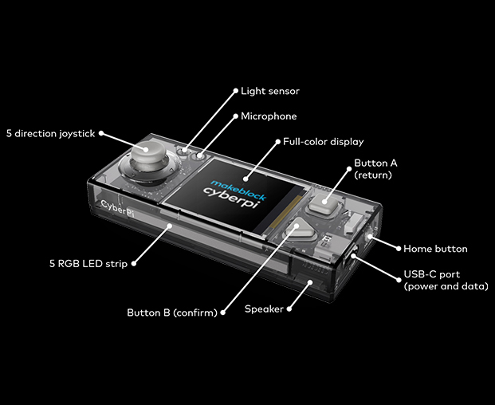
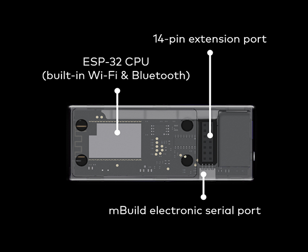
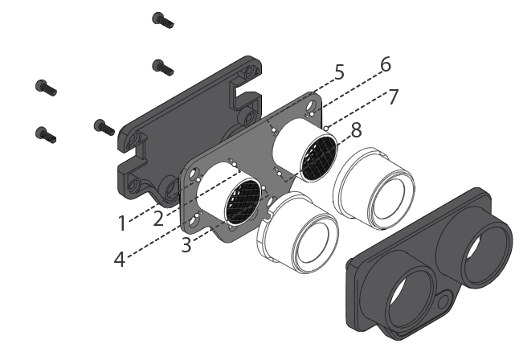
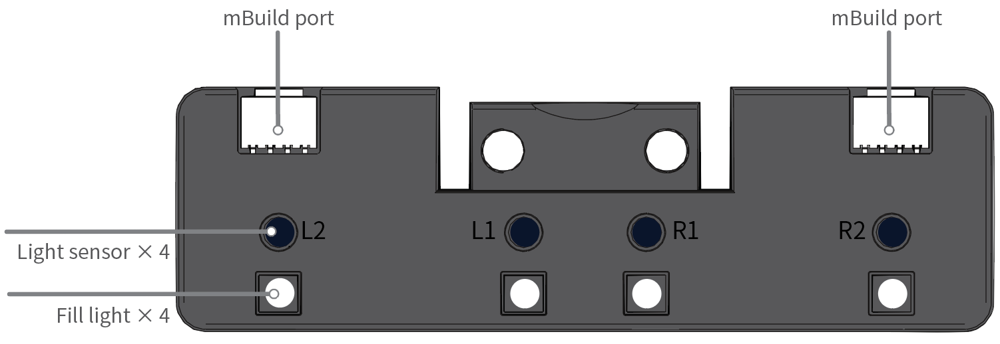
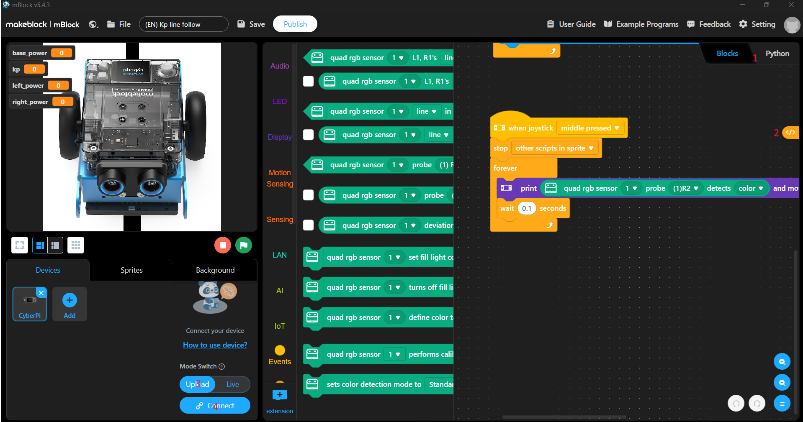

### mBlock/mBot2

#### Introduction

##### The purpose of this documentation is to provide a comprehensive guide for students in order for them to make use of the Makeblock mBot2 robot device. This document aims to do the following:

###### 1. Inform users: The document aims to offer detailed information about the features, specifications, and capabilities of the mBot2 device, ensuring that users understand 

###### 2. Facilitate Setup: The document aims to provide clear, step-by-step instructions for assembling the device, installing necessary software, and connecting the robot to devices.

###### 3: Guide Programming: The document will provide an introduction to programming concepts relevant to the mBot2 device, and provide a series of code snippets demonstrating various features of the device.

#### mBot2 overview

##### The mBot2[3] is an advanced educational robotics package developed by Makeblock[1], that is designed primarily for STEM (Science, Technology, Engineering, and Mathematics) education. The mBot2 is the successor product to the original mBot[4], offering enhanced features and functionalities that support more complex learning scenarios. The mBot2 was developed and is provided by Makeblock Co. Ltd. [1][2], a Chinese technology company headquartered in Shenzhen, China.

#### Key Features of the mBot2:

##### - 1. CyberPi Microcontroller[5][6]:
[5]
[5]
###### The mBot2 is powered by the CyberPi, a microcontroller equipped with a light sensor, microphone, full colour display, mono speaker, 5-diode RGB LED strip, peripheral ports (USB-C power/data port, 14-pin extension port), an ESP-32 CPU (built-in WI-FI and Bluetooth), a digital 5-direction joystick, and three digital face buttons ("Button A", "Button B", and "Home Button"). 
###### The CyberPi connects to the mBot2 Shield expansion module and provides an user interface, as well as the CPU used to run mBlock programs.

##### - 2. mBot2 Shield:
####  [7]
###### The mBot2 Shield is an expansion board that enhances the capabilities of the mBot2. The mBot2 Shield provides additional ports and interfaces to connect more sensors, actuators, and other devices to the mBot2 package.

###### The mBot2 Shield offers the following ports: Multi-function ports S1 and S2, mBuild port, Servo ports S3 and S4, DC motor ports M1 and M2, and Encoder motors EM1 and EM2. The device also includes a CyberPi port that interfaces with the 14-pin extension port of the CyberPi device. The mBot2 Shield also provides an upgraded power management system that allows the device to provide stable power to additional connected components.

##### - 3. Additional Sensors:

[10]
###### Ultrasonic Sensor "2" - An upgraded version of the original ultrasonic sensor designed for use within Makeblock robotics kits. This sensor allows robots  to measure the distance to objects in their environment, and can therefore be used for tasks such as obstacle detection and avoidance. The Ultrasonic Sensor "2" has a range of between 3cm and 300 cm at a detection angle of 30 degrees.[10] 

 [11]
###### Quad RGB Sensor - An advanced sensor module designed for detecting colours and following lines. The RGB sensor consists of four seperate RGB sensors arranged in a line. Each sensor can independently detect the colour and intensity of light that falls on it, allowing the module to accurately detect coloured lines, patterns, and surfaces.[11]

### Assembling the mBot2

#### Components included:

##### 1. CyberPi microcontroller.
##### 2. mBot2 Shield expansion module.
##### 3. Ultrasonic Sensor "2".
##### 4. Quad RGB Sensor.
##### 5. Encoder Motor (2).
##### 6. Aluminium Chassis.
##### 7. Wheel Hubs (2).
##### 8. Slick Tyres (2).
##### 9. Mini castor wheel.
##### 10. Motor Cable (2).
##### 11. mBuild Cable 10cm (2).
##### 12. mBuild Cable 20cm.
##### 13. M4*25mm screws (6).
##### 14. M4*14mm screws (6).
##### 15. M4*8mm screws (6).
##### 16. M2.5*12mm screws (4).
##### 17. Paper Line-following track map.
##### 18. USB A - USB Micro C Cable.
##### 19. Multi-head screwdriver.

#### Assembly Guide - https://support.makeblock.com/hc/en-us/articles/1500006253942-Assemble-mBot-Neo-mBot2

### Programming for the mBot2

#### Setting up the mBlock development environment:

##### The mBlock IDE is an integrated development environment devised by Makeblock. It is designed to help users, students and educators in particular, to create programs for Makeblock's robotics kits and other compatible devices.[12]

##### Download the latest release for your platform from the following link - https://mblock.cc/pages/downloads#mlink [12]


##### After installation the mBlock interface should resemble the above image. The labeled section "1" allows the user to select between the mBlock block-based programming language, and Python to create programs for the device. Block based programs can be translated to Python using the button labeled "2", which provides an additional avenue through which users are able to assist in their learning.

#### Using mBot2 functions

##### Using the CyberPi API is relatively easy and straightforward for users who have had prior experience with python programming. Relevant sections of the associated API follow:

##### Root of Python API - https://www.yuque.com/makeblock-help-center-en/mcode/cyberpi-api#

##### Cyberpi LED API - https://www.yuque.com/makeblock-help-center-en/mcode/cyberpi-api#489cb72f

##### Cyberpi LCD display API - https://www.yuque.com/makeblock-help-center-en/mcode/cyberpi-api#4d775d4c

##### Cyberpi controller sensor output (Buttons/Sensor Output/Timer) API - https://www.yuque.com/makeblock-help-center-en/mcode/cyberpi-api#15944350

##### mBot2 Shield Extension Board Motor Control API - https://www.yuque.com/makeblock-help-center-en/mcode/cyberpi-api-shields#d3OVV

##### Quad RGB module API - https://www.yuque.com/makeblock-help-center-en/mcode/cyberpi-api-mbuild#4ZWaI

##### Ultrasonic2 module API - https://www.yuque.com/makeblock-help-center-en/mcode/cyberpi-api-mbuild#Q98jI

#### Basic Function Documentations:

##### - Motion

###### Forward Motion:
###### mbot2.forward(50, t) - Moves forward at specified speed
###### Parameters:
###### speed: float, speed at which the encoder motors of mBot2 rotate, ranges from -200 to +200 revolutions per minute.\n Negative values cause reverse motion.
###### t: float or str, default value is "null". "Time" in seconds, when t is float it indicates the duration at which \nthe mBot2 will move forwards. Accepts values between 0.0 to +∞ (functionally infinite). \nWhen t is null the motor will continue running until a stop instruction is performed.
###### Example: mbot2.forward(50, 5) - Moves Mbot2 forwards at a speed of 50RPM for five seconds.
###### Example 2 : mbot2.forward(-50, 5) - Moves Mbot2 backwards at a speed of 50RPM for five seconds.

###### Backward motion:
###### mbot2.backward(50, t) - Moves backward at speicfied speed
###### Parameters:
###### speed: float, speed at which the encoder motors of mBot2 rotate, ranges from -200 to +200 revolutions per minute.\n Negative values cause reverse motion.
###### t: float or str, default value is "null". "Time" in seconds, when t is float it indicates the duration at which \nthe mBot2 will move backwards. Accepts values between 0.0 to +∞ (functionally infinite). \nWhen t is null the motor will continue running until a stop instruction is performed.
###### Example: mbot2.backward(50, 5) - Moves Mbot2 backward at a speed of 50RPM for five seconds.
###### Example 2 : mbot2.backward(-50, 5) - Moves Mbot2 forwards at a speed of 50RPM for five seconds.

###### NOTE: Given that both "Forwards" and "Backwards" are reversible, usage of both is for readability purposes.

###### Left Turn:
###### mbot2.turn_left(50, t) - Turns mBot2 left at specified speed
###### Parameters:
###### speed: float, speed at which the encoder motors of mBot2 rotate, ranges revolutions per minute.\n Negative values cause right turns instead.
###### t: float or str, default value is "null". "Time" in seconds, when t is float it indicates the duration at which \nthe mBot2 will move leftwards. Accepts values between 0.0 to +∞ (functionally infinite). \nWhen t is null the motor will continue running until a stop instruction is performed.
###### Example: mbot2.turn_left(50, 5) - Moves Mbot2 leftwards at a speed of 50RPM for five seconds.
###### Example 2 : mbot2.turn_left(-50, 5) - Moves Mbot2 rightwards at a speed of 50RPM for five seconds.

###### Right Turn:
###### mbot2.turn_right(50, t) - Turns mBot2 right at specified speed
###### Parameters:
###### speed: float, speed at which the encoder motors of mBot2 rotate, ranges revolutions per minute.\n Negative values cause left turns instead.
###### t: float or str, default value is "null". "Time" in seconds, when t is float it indicates the duration at which \nthe mBot2 will move rightwards. Accepts values between 0.0 to +∞ (functionally infinite). \nWhen t is null the motor will continue running until a stop instruction is performed.
###### Example: mbot2.turn_right(50, 5) - Moves Mbot2 rightwards at a speed of 50RPM for five seconds.
###### Example 2 : mbot2.turn_right(-50, 5) - Moves Mbot2 leftwards at a speed of 50RPM for five seconds.

###### NOTE: Given that both "turn_left" and "turn_right" are reversible, usage of both is for readability purposes.

###### Forwards/Backwards Motion (Alternate):
###### mbot2.straight(distance, speed = 50)
###### An alternate method of moving forwards or backwards. To ensure accuracy, the Mbot2 will move at the preset speed when this function is executed. 
###### Parameters: 
###### distance: float, the distance in centimeters the mBot2 is to move forwards. If "distance" is a negative value the Mbot2 will move backwards.
###### speed: float, speed at which the encoder motors of mBot2 rotate, ranges revolutions per minute. Default value in this case is 50 RPM. If negative values are set then the absolute value will be used instead (e.g: a value of -50 will be treated as +50)
###### Example: mbot2.straight(30, 50) - Moves Mbot2 forwards at a speed of 50RPM until it reaches a distance of 30cm from the starting location.
###### Example 2 : mbot2.straight(-30, 50) - Moves Mbot2 backward at a speed of 50RPM until it reaches a distance of 30cm from the starting location.
###### Example 3: mbot2.straight(30, -50) - Moves Mbot2 forwards at a speed of 50RPM until it reaches a distance of 30cm from the starting location. (-50 speed is treated as +50 speed)

###### Turning left/right (Alternate):
###### mbot2.turn(angle, speed = 50)
###### Turns Mbot2 clockwise at the specified angle. To ensure accuracy, the Mbot2 will move at the preset speed when this function is executed. 
###### Parameters:
###### angle: int, the number of degrees Mbot2 is to turn clockwise. A negative value results in counterclockwise turning.
###### speed: float, speed at which the encoder motors of mBot2 rotate, ranges between 0 to +200 RPM revolutions per minute. Default value in this case is 50 RPM. If negative values are set then the absolute value will be used instead (e.g: a value of -50 will be treated as +50).
###### Example: mbot2.turn(30, 50) - Turns mBot2 clockwise to an angle of 30 degrees at a speed of 50 RPM.
###### Example: mbot2.turn(-30, 50) - Turns mBot2 anticlockwise to an angle of 30 ("-30") degrees at a speed of 50 RPM.

###### Individual drive power/synchronisation:
###### mbot2.drive_power(EM1_power, EM2_power)
###### Sets the power of the two encoder motors. E1 (Connected to the left wheel of the Mbot2 by default), and EM2 (Connected to the right wheel of the Mbot2 by default). This function is intended to help ensure synchronisation of the two encoder motors, and can be used to trim the motors if one is out of phase.
###### Parameters:
###### EM1_power: float, power of the EM1 encoder motor (Left wheel), ranges from -100 to +100 expressed as a percentage of possible power. A positive value results in the output shaft rotating anticlockwise, a negative value results in the output shaft rotating clockwise, and a value of 0 results in no rotation.
###### EM2_power: float, power of the EM2 encoder motor (Right wheel), ranges from -100 to +100 expressed as a percentage of possible power. A positive value results in the output shaft rotating anticlockwise, a negative value results in the output shaft rotating clockwise, and a value of 0 results in no rotation.
###### Example usage:
```
import cyberpi


speed = 50
cyberpi.audio.set_vol(10)
while True:
    if cyberpi.controller.is_press('a'):
        cyberpi.audio.play_until('switch')
        cyberpi.mbot2.drive_power(speed, speed)
    if cyberpi.controller.is_press("b"):
        cyberpi.audio.play_until('switch')
        cyberpi.mbot2.drive_power(0, 0)
```

###### Individual drive speed/synchronisation:
###### mbot2.drive_speed(EM1_speed, EM2_speed)
###### Sets the rotation speed of the two encoder motors. E1 (Connected to the left wheel of the Mbot2 by default), and EM2 (Connected to the right wheel of the Mbot2 by default). This function is intended to help ensure synchronisation of the two encoder motors, and can be used to trim the motors if one is out of phase.
###### Parameters:
###### EM1_speed: float, rotating speed of the EM1 encoder motor (Left wheel), ranges from -200 to +200 expressed as RPM. A positive value results in the output shaft rotating anticlockwise, a negative value results in the output shaft rotating clockwise, and a value of 0 results in no rotation.
###### EM2_speed: float, rotating speed of the EM2 encoder motor (Right wheel), ranges from -200 to +200 expressed as RPM. A positive value results in the output shaft rotating anticlockwise, a negative value results in the output shaft rotating clockwise, and a value of 0 results in no rotation.
###### Example: mbot2.drive_speed(100,100), both E1 and E2 rotate anticlockwise at a rate of 100RPM.

###### Stop Rotation:
###### mbot2.EM_stop(port = "all")
###### Stops the rotation of the encoder motor connected to a specified port.
###### Parameter: 
###### port: float or str, port to which the encoder is connected.
###### Default value: "all", possible values: "all", "em1", "em2", "ALL", "EM1", "EM2", 1, 2
###### Example: mbot2.EM_stop(port = "em1"), stops rotation of encoder motor connected to port "e1".


#### Example programs:

##### - LCD DISPLAY TEST 
```
from makeblock import *
import cyberpi
import time

def DisplayMessage(message):
    cyberpi.display.clear()
    cyberpi.console.print(message)

# Main loop
while True:
    if cyberpi.controller.is_press("a"):
        if not buttonADepressed:
            DisplayMessage("Button \"A\" Pressed")
            buttonADepressed = True
    else:
        buttonADepressed = False

    if cyberpi.controller.is_press("b"):
        if not buttonBDepressed:
            DisplayMessage("Button \"b\" Pressed")
            buttonBDepressed = True
    else:
        buttonBDepressed = False

    time.sleep(0.1)
```

##### - SPEAKER TEST

```
from makeblock import *
import cyberpi
import time

def PlaySound(frequency):
    cyberpi.display.clear()
    cyberpi.console.print("Sound of Frequency " + str(frequency) + " Playing")
    cyberpi.audio.play_tone(frequency, 1)

# Main loop
while True:
    if cyberpi.controller.is_press("a"):
        if not buttonADepressed:
            PlaySound(100)
            buttonADepressed = True
    else:
        buttonADepressed = False

    if cyberpi.controller.is_press("b"):
        if not buttonBDepressed:
            PlaySound(1000)
            buttonBDepressed = True
    else:
        buttonBDepressed = False

    time.sleep(0.1)
```

##### - LED LIGHT TEST

```
from makeblock import *
import cyberpi
import time
import random

testInProgress = False
displayStartMessage = False

def BeginLEDTest():
    cyberpi.display.clear()
    cyberpi.console.print("Please wait, LED test in progress.")

    # Global variables for display purposes
    global testInProgress
    global displayStartMessage 
    testInProgress = True

    # LED Test

    testTime = 100
    redVal = 0
    greenVal = 0
    blueVal = 0

    while (testTime > 0):

        # Randomly determine an LED to light, and a hue for that LED
        redVal = random.randint(0,255)
        greenVal = random.randint(0,255)
        blueVal = random.randint(0,255)
        ledNum = random.randint(1,5)

        # Turns on selected LED and sets it to a given hue
        cyberpi.led.on(redVal, greenVal, blueVal, ledNum)
        time.sleep(0.1)
        testTime -= 1

    cyberpi.led.off()

    testInProgress = False
    displayStartMessage = False
    cyberpi.display.clear()

# Main loop
while True:

    if not testInProgress:
        
        if not displayStartMessage:
            cyberpi.display.clear()
            cyberpi.console.print("Please press button \"A\" to begin LED test.")
            displayStartMessage = True

        if cyberpi.controller.is_press("a"):
            BeginLEDTest()

    time.sleep(0.1)
```

##### - BASIC MOTOR TEST

```
from makeblock import *
import cyberpi
import mbot2
import time
import random

testInProgress = False
displayStartMessage = False

def BeginMotorTest():
    cyberpi.display.clear()
    cyberpi.console.print("Please wait, Motor test in progress.")

    # Global variables for display purposes
    global testInProgress
    global displayStartMessage 
    testInProgress = True

    # Motor Test

    mbot2.forward(50, 5)
    time.sleep(0.5)
    mbot2.backward(50, 5)
    time.sleep(0.5)
    mbot2.turn_left(50, 5)
    time.sleep(0.5)
    mbot2.turn_right(50, 5)
    time.sleep(0.5)


    testInProgress = False
    displayStartMessage = False
    cyberpi.display.clear()

# Main loop
while True:

    if not testInProgress:
        
        if not displayStartMessage:
            cyberpi.display.clear()
            cyberpi.console.print("Please press button \"A\" to begin Motor test.")
            displayStartMessage = True

        if cyberpi.controller.is_press("a"):
            BeginMotorTest()

    time.sleep(0.1) 
```

##### - ULTRASONIC SENSOR TEST 
```
from makeblock import *
import cyberpi
from cyberpi import *
import mbot2
import time
import random

testInProgress = False
displayStartMessage = False

def BeginUltrasonicSensorTest():
    cyberpi.display.clear()

    # Global variables for display purposes
    global testInProgress
    global displayStartMessage 
    testInProgress = True

    # Sensor Test

    while (True):
        cyberpi.display.clear()
        cyberpi.console.print("Object detected " + str(cyberpi.ultrasonic2.get(1)) + "cm from sensor\nPress \"A\" to end test.")

        if cyberpi.controller.is_press("a"):
            break
        time.sleep(1)

    testInProgress = False
    displayStartMessage = False
    cyberpi.display.clear()

# Main loop
while True:

    if not testInProgress:
        
        if not displayStartMessage:
            cyberpi.display.clear()
            cyberpi.console.print("Please press button \"A\" to begin Sensor test.")
            displayStartMessage = True

        if cyberpi.controller.is_press("a"):
            BeginUltrasonicSensorTest()

    time.sleep(0.1)
```
##### - RGB SENSOR TEST 

```
from makeblock import *
import cyberpi
from cyberpi import *
import mbot2
import time
import random

testInProgress = False
displayStartMessage = False

def BeginRGBSensorTest():
    cyberpi.display.clear()

    # Global variables for display purposes
    global testInProgress
    global displayStartMessage 
    testInProgress = True

    # Sensor Test

    while (True):
        cyberpi.display.clear()
        cyberpi.console.print("Line Data: " + str(cyberpi.quad_rgb_sensor.get_line_sta(1)) + "\nPress \"A\" to end test.")

        if cyberpi.controller.is_press("a"):
            break
        time.sleep(1)

    testInProgress = False
    displayStartMessage = False
    cyberpi.display.clear()

# Main loop
while True:

    if not testInProgress:
        
        if not displayStartMessage:
            cyberpi.display.clear()
            cyberpi.console.print("Please press button \"A\" to begin Sensor test.")
            displayStartMessage = True

        if cyberpi.controller.is_press("a"):
            BeginRGBSensorTest()

    time.sleep(0.1)
```

##### - BASIC LINE FOLLOWING PROGRAM [TODO]

### F.A.Q

##### 1: Q: "What software do I require in order to program for the mBot2 device?"

##### 1: A: The mBot2 requires the use of MakeBlock's mBlock software in order to upload programs and interact with the device.

##### 2: Q: "Is there an alternative method I can use to upload programs to the mBot2 device?"

##### 2: A: Unfortunately the mBot2 uses a proprietary firmware that necessitates the use of the mBlock software package in order to interact with the device. Earlier versions of the device (such as the mBot) were more heavily based on Arduino architecture, and so were able to use software such as Thonny and the Arduino IDE in order to load programs. The mBot2 uses the "cyberPi" architecture, which is incompatible with these previous options.

##### 3: Q: "What languages can I use to program the mBot2 device?"

##### 3: A: The mBot2 officially supports Python and MakeBlock's proprietary Block-Based coding solution. 

##### 4: Q: "How do I connect the mBot2 device with my computer?"

##### 4: A: The mBot2 can be connected with a PC using either an USB-A to USB-C data cable, or through the use of a bluetooth dongle.

##### 5: Q: 

##### 5: A: 


### Bibliography and references

#### [1] - Makeblock customer website https://www.makeblock.com/

#### [2] Makeblock Co. Ltd Wikipedia overview https://www.makeblock.com/pages/mbot2-coding-robot

#### [3] - Makeblock mBot2 overview https://www.makeblock.com/pages/mbot2-coding-robot

#### [4] - Makeblock mBot overview https://www.makeblock.com/collections/all/products/buy-mbot

#### [5] - CyberPi Microcontroller overview https://logicsacademy.com/cyberpi/

#### [6] - CyberPi Microcontroller product page https://www.makeblock.com/products/buy-cyberpi

#### [7] - mBot2 documentation https://www.yuque.com/makeblock-help-center-en/mcode/cyberpi-api-shields#9eo89

#### [8] - Input device documentation https://support.makeblock.com/hc/en-us/articles/20072497351063-Input-modules

#### [9] - mBot2 Assembly Guide https://support.makeblock.com/hc/en-us/articles/1500006253942-Assemble-mBot-Neo-mBot2

#### [10] - Ultrasonic Sensor 2 information (Archive) https://web.archive.org/web/20220706220717/https://education.makeblock.com/help/ultrasonic-sensor-2/

#### [11] - Quad RGB Sensor information (Archive) https://web.archive.org/web/20231207172308/https://education.makeblock.com/help/mbuild-quad-rgb-sensor/

#### [12] -  mBlock IDE download page https://mblock.cc/pages/downloads#mlink